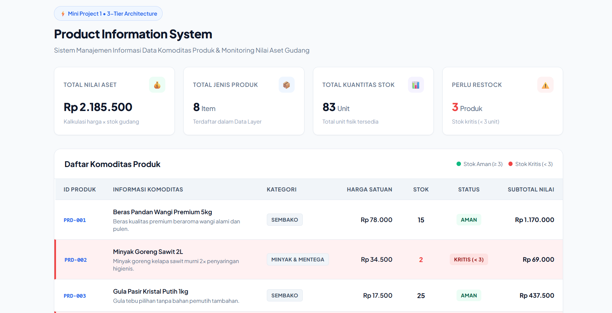

# Mini Project 1: Product Information System

> **Mata Kuliah:** Pemrograman Web (Pertemuan 2)  
> **Fokus Utama:** Server-Side Programming, Multidimensional Associative Array, Modular Architecture (Separation of Concerns), & Logic Implementation.  
> **Engine:** PHP Native (Murni tanpa Framework & tanpa Database SQL Eksternal).

---

## 1. Ikhtisar & Tujuan Proyek

Proyek ini bertujuan untuk merancang dan mengimplementasikan **Sistem Informasi Manajemen & Pemantauan Data Komoditas Produk Inventori Gudang** berbasis *server-side rendering* menggunakan PHP Native murni.

Aplikasi ini mengaplikasikan konsep **Multidimensional Associative Array** untuk merepresentasikan tabel data produk dalam memori runtime. Seluruh struktur kode dibangun menggunakan arsitektur modular **Separation of Concerns (SoC) / 3-Tier Architecture** yang memisahkan tanggung jawab aplikasi secara rapi ke dalam lapisan:
- **Data Layer (`products.php`)**: Penyedia dataset produk komoditas.
- **Processing Layer (`functions.php`)**: Repositori logika bisnis, kalkulasi agregasi aset, evaluasi status ketersediaan stok, dan formatting Rupiah.
- **Presentation & Styling Layer (`index.php`)**: Perajut komponen, orkestrator antarmuka, dan perender tampilan semantik responsif dengan styling modern.

### Capaian Pembelajaran:
- Memahami siklus hidup penanganan data kolektif di server (*server-side processing*) sebelum dikirimkan ke browser sebagai HTML murni.
- Menerapkan prinsip *Separation of Concerns (SoC)* dan *Single Responsibility Principle (SRP)* agar kode bebas redundansi, bersih (*clean code*), dan mudah dirawat.
- Mengimplementasikan kalkulasi agregasi matematika, evaluasi status ketersediaan barang secara dinamis, serta pewarnaan baris berbasis kondisi (*conditional row styling*).

---

## 2. Dokumentasi Tangkapan Layar (Screenshots)

Berikut adalah dokumentasi tampilan antarmuka web **Product Information System**:

### Tampilan Dashboard & Pemantauan Produk


> **Catatan:** Panduan penempatan dan pengambilan gambar tangkapan layar dapat dilihat pada [Bagian 6](#6-panduan-penempatan-gambar-screenshots).

---

## 3. Struktur Direktori & Arsitektur Sistem

Struktur direktori proyek disusun secara modular sebagai berikut:

```text
Mini_project/
├── products.php            # [Data Layer] Dataset produk komoditas (Multidimensional Array)
├── functions.php           # [Processing Layer] Logika bisnis, fungsi kalkulasi nilai & status stok
├── index.php               # [Presentation Layer] Orchestrator modular & perender tampilan HTML/CSS
├── README.md               # Dokumentasi lengkap proyek
└── Asset/                  # [Media Directory] Tempat penyimpanan berkas screenshot antarmuka
    └── screenshot_dashboard.png
```

### Matriks Tanggung Jawab Modul:

| Nama Berkas | Layer Arsitektur | Tanggung Jawab Utama |
| :--- | :--- | :--- |
| `products.php` | **Data Layer** | Menampung dataset komoditas produk dalam bentuk *Multidimensional Associative Array* lengkap dengan atribut ID, Nama, Kategori, Harga, Stok, dan Deskripsi. |
| `functions.php` | **Processing Layer** | Menyediakan fungsi-fungsi independen (*pure functions*) untuk kalkulasi total aset, total kuantitas stok, deteksi jumlah stok kritis, penentuan kelas visual baris & badge status, serta pemformat mata uang Rupiah. |
| `index.php` | **Presentation Layer** | Memuat dependensi via `require_once`, mengeksekusi kalkulasi metrik ringkasan, merender kartu ringkasan eksekutif (*summary cards*), dan menampilkan tabel semantik data produk dengan pewarnaan kondisional. |

---

## 4. Rincian Spesifikasi Setiap Modul

### A. Data Layer (`products.php`)
Menyimpan dataset produk berupa array multidimensi dengan skema kunci terstandar:
- `id` *(string)*: Kode identifikasi unik produk (contoh: `"PRD-001"`).
- `nama` *(string)*: Nama komoditas barang (contoh: `"Beras Pandan Wangi Premium 5kg"`).
- `kategori` *(string)*: Klasifikasi barang (contoh: `"Sembako"`, `"Minuman"`, `"Bahan Kue"`, `"Minyak & Mentega"`).
- `harga` *(int)*: Harga satuan per produk dalam Rupiah.
- `stok` *(int)*: Jumlah kuantitas fisik yang tersedia di gudang.
- `deskripsi` *(string)*: Deskripsi singkat spesifikasi produk.

### B. Processing Layer (`functions.php`)
Berisi kumpulan fungsi pemrosesan logika bisnis terisolasi:
1. `hitungTotalNilaiStok(array $products): float`  
   Mengakumulasikan total valuasi nilai aset gudang ($\sum \text{harga} \times \text{stok}$).
2. `hitungTotalKuantitasStok(array $products): int`  
   Menghitung total seluruh kuantitas unit fisik produk yang ada di gudang.
3. `hitungJumlahStokKritis(array $products): int`  
   Menghitung banyaknya varian produk yang memiliki stok di bawah ambang batas (`stok < 3`).
4. `getStatusStok(int $stok): array`  
   Mengevaluasi stok dan mengembalikan konfigurasi visual dinamis:
   - **Stok $\le$ 0 (Habis):** Baris tabel `row-stock-out` (latar merah muda/pink), badge `badge-out` label `"Habis (0)"`.
   - **Stok $<$ 3 (Kritis):** Baris tabel `row-critical` (latar merah lembut dengan aksen border merah), badge `badge-critical` beranimasi *pulse*, label `"Kritis (< 3)"`.
   - **Stok $\ge$ 3 (Aman):** Baris tabel `row-normal`, badge `badge-normal` label `"Aman"`.
5. `formatRupiah($angka): string`  
   Mengonversi nilai numerik ke format baku mata uang Indonesia (contoh: `78000` $\rightarrow$ `"Rp 78.000"`).

### C. Presentation Layer (`index.php`)
- **Modul Loader**: Memuat `products.php` dan `functions.php` secara aman di awal berkas menggunakan `require_once`.
- **Kartu Ringkasan Eksekutif (*Stats Grid*)**: Menampilkan 4 kartu indikator utama:
  1. *Total Nilai Aset* (Kalkulasi akumulasi harga $\times$ stok).
  2. *Total Jenis Produk* (Jumlah entri produk terdaftar).
  3. *Total Kuantitas Stok* (Akumulasi seluruh unit fisik).
  4. *Perlu Restock* (Jumlah produk berstatus kritis atau habis).
- **Tabel Data Semantik**: Merender seluruh data produk secara dinamis menggunakan perulangan `foreach` dengan proteksi sanitasi `htmlspecialchars()` untuk keamanan dari ancaman *Cross-Site Scripting (XSS)*.
- **Tabel Footer Ringkasan**: Menampilkan baris rekapitulasi total unit dan total nilai aset gudang secara otomatis di bagian bawah tabel.

---

## 5. Fitur Unggulan Antarmuka & UX

- **Desain Modern & Responsif**: Menggunakan palet warna slate modern, tipografi Google Fonts (*Plus Jakarta Sans*), dan layout fleksibel yang adaptif pada perangkat mobile maupun desktop.
- **Visual Alerting**: Baris produk dengan stok kritis atau habis otomatis ditandai dengan warna kontras dan badge status interaktif sehingga memudahkan pengawas gudang melakukan identifikasi cepat.
- **Legenda Indikator**: Dilengkapi komponen legenda visual (*legend dots*) untuk mempermudah interpretasi status stok.

---

## 6. Panduan Penempatan Gambar (Screenshots)

Untuk menampilkan gambar tangkapan layar pada berkas `README.md`:

1. Buat folder bernama `Asset` di dalam direktori utama proyek (jika belum ada).
2. Jalankan aplikasi web di browser dan lakukan tangkapan layar (*screenshot*) menggunakan shortcut bawaan Windows:
   - Tekan **`Win + Shift + S`**, lalu seleksi area antarmuka web.
3. Simpan hasil gambar tangkapan layar ke dalam folder `Asset/` dengan nama:
   - `Asset/screenshot_dashboard.png`
4. Saat berkas `README.md` dibuka di GitHub, VS Code, atau Markdown Previewer, gambar akan otomatis tampil.

---

## 7. Panduan Menjalankan & Menguji Aplikasi

1. Buka Terminal / Command Prompt pada direktori proyek:
   ```bash
   cd "C:\Users\LOQi5-3050\OneDrive\Desktop\Mini_project"
   ```

2. Jalankan PHP Built-in Server:
   ```bash
   php -S localhost:8000
   ```

3. Buka peramban web (*browser*) dan akses URL berikut:
   ```text
   http://localhost:8000/index.php
   ```

---

## 8. Kriteria Penilaian & Acceptance Checklist

- [x] **Separation of Concerns (SoC)**: Pemisahan kode yang tegas antara *Data Layer* (`products.php`), *Processing Layer* (`functions.php`), dan *Presentation Layer* (`index.php`).
- [x] **Multidimensional Array**: Dataset komoditas terstruktur rapi dengan skema data lengkap (`id`, `nama`, `kategori`, `harga`, `stok`, `deskripsi`).
- [x] **Kalkulasi Bisnis Akurat**: Fungsi `hitungTotalNilaiStok()`, `hitungTotalKuantitasStok()`, dan `hitungJumlahStokKritis()` menghitung agregasi data secara tepat.
- [x] **Pewarnaan Baris Dinamis**: Baris tabel dan badge status otomatis berganti warna sesuai kondisi stok ($= 0$, $< 3$, $\ge 3$).
- [x] **Modular Loading**: Dependensi dimuat secara konsisten menggunakan `require_once`.
- [x] **Sanitasi Data Output**: Menggunakan `htmlspecialchars()` pada perenderan data string ke HTML.
- [x] **Bebas Galat**: Tidak ada *Syntax Error*, *Runtime Warning*, maupun *Logic Error* saat dieksekusi di server PHP.

---
*Dokumentasi disusun untuk memenuhi Tugas Mini Project 1 - Pertemuan 2 Mata Kuliah Pemrograman Web.*
